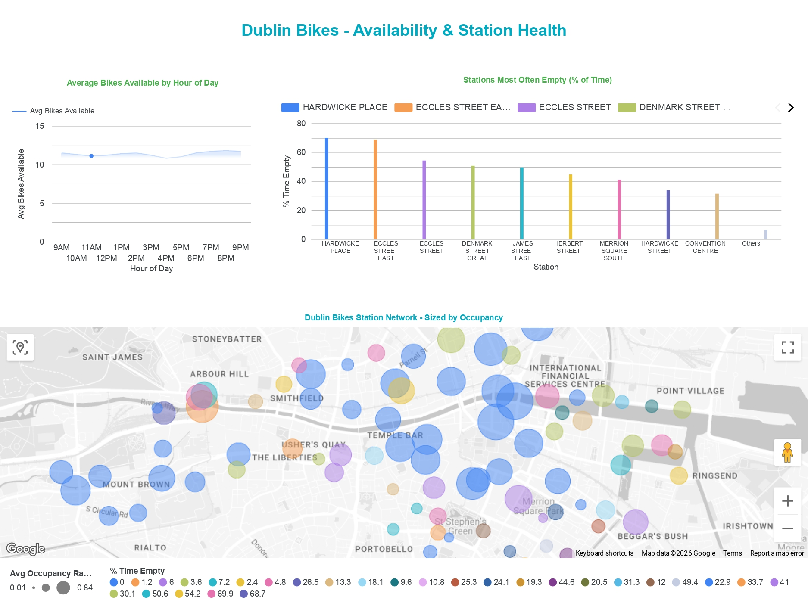

# Dublin Bikes Data Pipeline

An end-to-end data pipeline that ingests live Dublin Bikes station data, transforms it into analysis-ready tables, and surfaces availability and station-health insights through an interactive dashboard.

**Live dashboard:**

[](https://datastudio.google.com/s/jqqFSljMhps)

*Click the image for the interactive dashboard.*

---

## What it does

Every 15 minutes, the pipeline pulls a live snapshot of all ~114 Dublin Bikes stations from the JCDecaux API, lands it in BigQuery, and rebuilds a set of clean, tested analytical tables with dbt. A Data Studio dashboard reads those tables to show how bike availability moves through the day and which stations most often run empty or full.

---

## Architecture

```
JCDecaux API
     │   Python fetch (requests)
     ▼
BigQuery - raw_station_status        (raw layer: one row per station per snapshot, partitioned by date)
     │   dbt transformations (SQL)
     ▼
BigQuery - stg_station_status        (staging: deduplicated, typed, epoch → timestamp, occupancy derived)
     │
     ▼
BigQuery - fct_station_hourly        (mart: average availability by hour of day)
BigQuery - fct_station_summary       (mart: per-station availability + % time empty / full)
     │   BigQuery connector
     ▼
Data Studio dashboard                (hourly trend, station map, most-empty stations)
```

Orchestration is handled by **Apache Airflow** (run locally via the Astro CLI in **Docker**), which schedules the ingestion, retries on failure, and provides run-level visibility.

---

## Tech stack

| Layer | Tool | Why |
|-------|------|-----|
| Source | JCDecaux API | Official live Dublin Bikes data |
| Ingestion | Python (`requests`, `google-cloud-bigquery`) | Fetch, flatten, load |
| Orchestration | Apache Airflow (Astro CLI) | Reliable 15-minute scheduling with retries |
| Environment | Docker | Reproducible, portable runtime for Airflow |
| Warehouse | Google BigQuery | Serverless storage and SQL compute |
| Transformation | dbt (dbt-bigquery) | Tested, documented, version-controlled SQL models |
| Visualisation | Data Studio (Looker Studio) | Free, native BigQuery dashboards |

---

## Data quality

Transformation is validated, not assumed. The dbt project runs **14 tests** across the models, including:

- `not_null` on all key fields (station id, snapshot timestamp, availability)
- `unique_combination_of_columns` on station + snapshot (proves deduplication works)
- `accepted_values` on station status (`OPEN` / `CLOSED`)
- `accepted_range` on occupancy ratio (0–1) and hour of day (0–23)
- source **freshness** checks that flag if ingestion stalls

---

## Project structure

```
dublin-bikes-pipeline/
├── dags/
│   └── dublin_bikes_ingestion.py     # Airflow DAG (every 15 min)
├── include/
│   ├── fetch_stations.py             # API → BigQuery load
│   ├── create_raw_table.sql          # raw table DDL
│   └── validate_raw_load.sql         # ingestion health check
├── dbt_dublin_bikes/
│   └── models/
│       ├── staging/                  # stg_station_status + tests
│       └── marts/                    # fct_station_hourly, fct_station_summary + tests
├── Dockerfile                        # Astro/Airflow runtime
├── requirements.txt
└── .env.example                      # required environment variables (no secrets)
```

---

## Running it locally

1. Clone the repo and add your credentials to a `.env` file (see `.env.example`) and a BigQuery service-account key at `include/gcp_keyfile.json`.
2. Start Airflow: `astro dev start` - the ingestion DAG runs every 15 minutes.
3. Build the models: `cd dbt_dublin_bikes && dbt deps && dbt run && dbt test`.

---

---

## Analysis

*Based on 15-minute snapshots of all 114 Dublin Bikes stations. City-wide mean occupancy across the collection window was **0.36** - on average, roughly a third of docks held a bike at any given time.*

### A clear supply imbalance between north and south of the Liffey

The most striking pattern is a geographic split. The stations that sit **empty most often are clustered north of the river**, while the stations that fill up **completely are concentrated on the south quays and central spine**.

**Chronically empty (bikes rarely available):**

| Station | % of time empty | Avg occupancy |
|---|---|---|
| Hardwicke Place | 69.9% | 0.01 |
| Eccles Street East | 68.7% | 0.01 |
| Eccles Street | 54.2% | 0.03 |
| Denmark Street Great | 50.6% | 0.05 |
| James Street East | 49.4% | 0.19 |

**Chronically full (no free stands to return a bike):**

| Station | % of time full | Avg occupancy |
|---|---|---|
| Georges Quay | 25.3% | 0.84 |
| Heuston Bridge (South) | 24.1% | 0.72 |
| Townsend Street | 22.9% | 0.83 |
| Cathal Brugha Street | 21.7% | 0.58 |
| Fownes Street Upper | 20.5% | 0.66 |

### What this suggests

The Hardwicke Place and Eccles Street cluster sits near the Mater Hospital and the north-city commuter belt - origin points where people take bikes *out* in the morning and don't return them until evening, so the docks drain and stay drained. Meanwhile the south-quay and city-centre stations (Georges Quay, Townsend Street) are destinations - bikes accumulate faster than they leave, and the stations jam full.

**Four of the 114 stations were empty more than half the time** (Hardwicke Place, Eccles Street East, Eccles Street and Denmark Street Great). For a rider, an empty origin station and a full destination station are the two ways the service fails, and both failure modes show up clearly in the data. This is exactly the signal a bike-share operator uses to plan overnight **rebalancing** - physically trucking bikes from the full southern stations back to the empty northern ones before the morning peak.

### Availability through the day

Across the collection window, city-wide availability stayed relatively flat (around 11 bikes per station on average), with a mild dip in the late afternoon as the evening commute began. A longer collection window - including early-morning and full weekend cycles - would sharpen the daily and weekday-versus-weekend patterns, which the current dataset only begins to show.

### A note on scope

These findings come from a limited collection window rather than a multi-week dataset, so they describe a representative snapshot rather than long-run averages. The pipeline is built to accumulate continuously; the same models and dashboard scale directly to a larger dataset as more snapshots are collected.

---

## Design notes

This project uses a deliberately production-shaped stack - Airflow for scheduled ingestion, Docker for a reproducible runtime, and dbt for tested transformations, because the value of the dashboard depends on data being collected reliably and transformed correctly, not just visualised.

One deliberate scoping choice: Airflow runs locally via the Astro CLI, so collection depends on the host machine being available. A fully production deployment would move ingestion to an always-on serverless scheduler - a natural extension rather than a redesign, since the pipeline logic stays identical.
